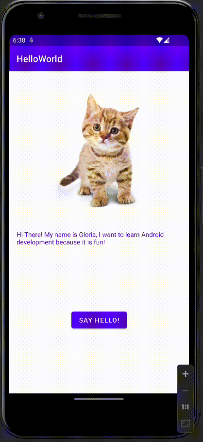

# AndroidHelloApp
submitted by: Gloria Dukuzeyesu
Time spent: 1 hr

The following functionalities are completed: 
1. ImageView: There is a cat image at middle top of the screen
2. A textview: An introductory message below the cat image
3. A button 
4. A Toast with a messages appears when button is pressed

Here's a walk through of implementation features 

copyright [2022] Gloria Dukuzeyesu

